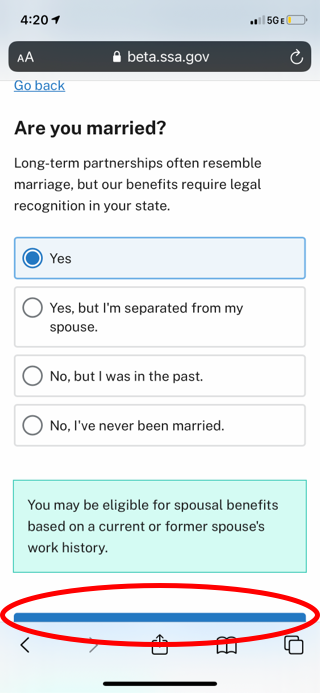

## Goals
* Define differences in mobile site that could effect navigation and flow and improve

## Mobile: Breadcrumbs Don't Function

### User Story
As a mobile SSA user, I would like to tap on the breadcrumb, so I can go up a previous level in the site

### Acceptance Criteria
* A user should be able to go to the home page from the breadcrumbs
* A link should not be styled as a link if it is not clickable

## Mobile: Official Government Header Takes Up Room

### User Story
As a mobile SSA user, I would to have as much vertical space as possible, so I can read the information without scrolling as much

### Acceptance Criteria
* User should see the official government site banner at the home page level
* The user should not see the banner once he/she goes one level deeper from the home page

### General Comments from Paul
* I don't know if this was mandated by SSA senior leadership, but it seems like a burden on the user to give up that vertical space on all mobile pages.

## Mobile: Items in Gray Footer are Not Seen

### User Story
As a mobile SSA user, I would like to know about the different children of a parent section, so I can have another route to navigate to what I'm looking for

### Acceptance Criteria
* User should see all children levels under each section, similar to how the beta site functions when a desktop browser window is reduced to the smallest width ([see screenshot here](images/desktopFooter.png))

## Mobile: Eligibility Checker Exit vs Back Button

### User Story
As a mobile SSA user who wants to exit the eligibility checker, I want to know how to leave the checker, so I don't accidentally go to the previous question instead.

### Acceptance Criteria
* Replace the image so it doesn't have a line through it or change the image to a label that reads 'Exit'
* Adjust the text 'Go back'
* Change the 'Go back' link to a secondary CTA style near the primary 'Next' CTA
* 'Next' and 'Back' CTAs should be on the same line

### General Comments from Paul
* I don't know if the 'x' button or an 'exit' label would be more comprehensible. Its my personal opinion that an 'exit' label would reduce anxiety and let the user know exactly what that button will do. However, on smaller devices, the 'exit' label might be too cramped with the SSA logo
* I don't know if there has been discussion around the 'go back' link, so I don't know if placement has already been tested or finalized.

## Mobile: Eligibility Checker Next Button Below Fold

### User Story
As a mobile user checking my eligibility, I want to quickly go through each step, so I can see if I'm eligible for benefits

### Acceptance Criteria
* The user should see the CTA above the fold
* CTAs should be locked to the bottom of the web view

### General Comments from Paul
* Is it more important to read the content (teal callouts) or find the cta to move to the next question? im about to write a user story to lock the cta to the bottom of the webview, which would mean the user wouldn't have to scroll to tap the next button, but might not see the call outs.

## Web: Eligibility Logic Bug

### Repo Steps
1. Go to eligibility Checker
2. Answer that you are over 18
3. Enter September 1, 2020 for birthday

### Expected Outcome
* Birthday is invalidated and you cannot proceed

### Actual Outcome
* Birthday is accepted and you can proceed

### Acceptance Criteria
* Add validation to the birthday criteria
