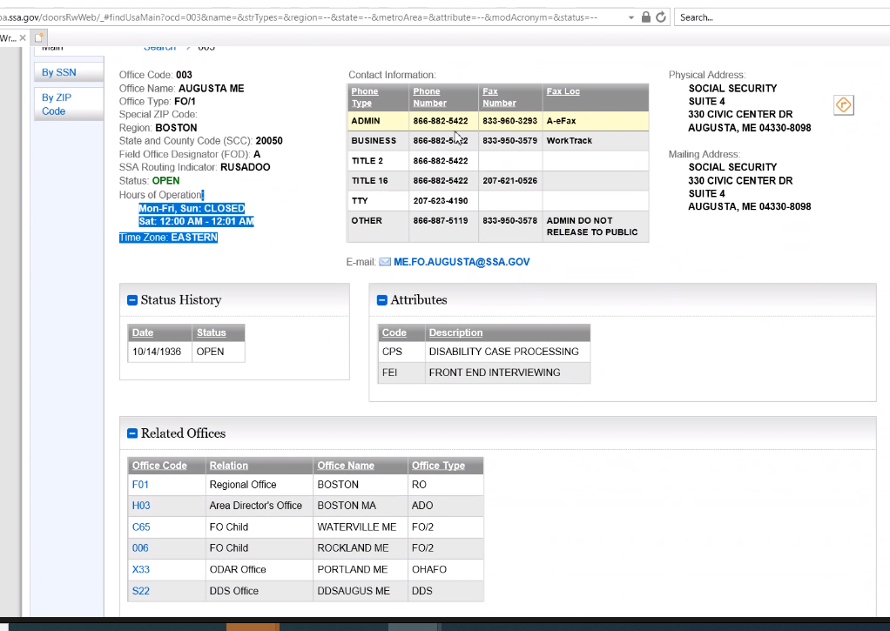
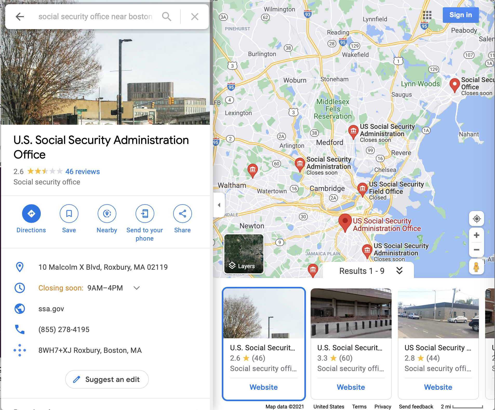

# Office locator
Notes on redesigning the office locator with the data in the DOORS system

# TODO
* Talk with Eric about controls (who in the local offices should be able to adjust things
* Look at data (more than just office locator - time to get to office, time to get from parking to office business, when it closes)
* What data can we get for geolocation?
* What can we launch?
* Can we launch iteratively? How can we get close to that?
* What is currently there?

# Available Data

### Questions on data
* Does a user need to know the physical address and the mailing address?
*

# Competition

## Social Security

## Google Maps

* Geomap with pins on offices near by
* pins have subheaders if the office is closing soon
* Tapping on it shows:
  * Image of office
  * Place name
  * star rating
  * number of reviews
  * Actions [directions, save, nearby, send to phone, share]
  * address
  * hours of business (and if opening/closing soon)
  * website
  * phone number
  * plus code (probably something for google)
  * Suggest an edit
  * Preview carousel of other offices
