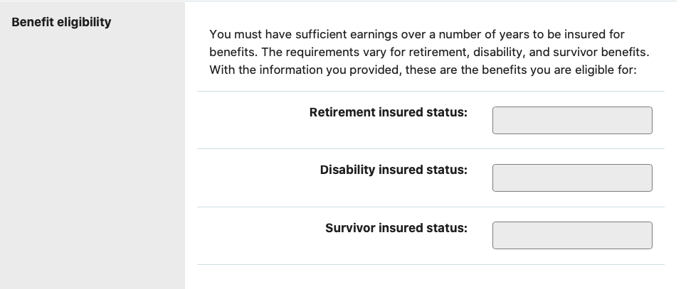
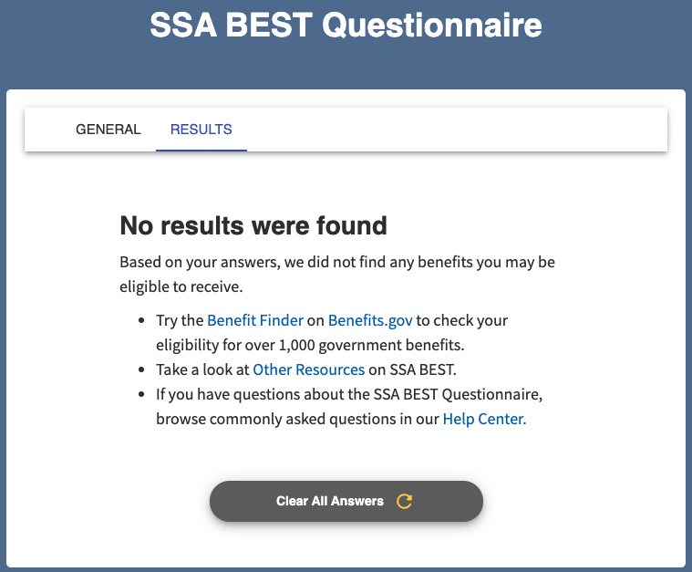
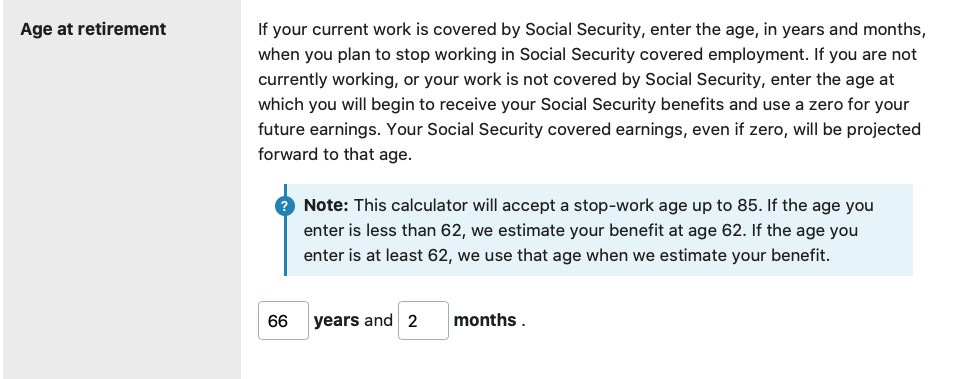

# Contents
* [Product Notes](#productNotes)
  * [Product Goals](#goals)
  * [Who Are We Building For?](#user)
  * [Current User Journey](#userJourney)
  * [Solution](#solution)
  * [Possible Scope](#possibleScope)
  * [Out of Scope](#outOfScope)
  * [Calculator](#calculator)
    * [Calculator Summary](#calcSummary)
    * [Benefits for Spouses](#spouseBeneCalc)
    * [Government Pension Offset Calculator](#gpoCalc)
    * [Late or Early Retirement](#lateOrEarlyCalc)
    * [Life Expectancy Calculator](#expectancyCalc)
    * [Online Benefits Calculator](#beneCalc)
    * [Quick Calculator](#quickCalc)
    * [Retirement Age Calculator](#ageCalc)
    * [Retirement Earnings Test Calculator](#earningsTestCalc)
    * [SSA Benefit Eligibility Screening Tool](#bestCalc)
    * [Windfall Elimination Provision](#windfallCalc)
* [Prepare for Retirement](#prepare)
  * [Prepare Page Summary](#summary)
  * [How it works](#howItWorks)
  * [Eligibility](#eligibility)
  * [Starting Benefits](#startingBenefits)
  * [Edge Cases](#edgeCases)
  * [Pensions and Windfalls](#pensionsAndWindfalls)

* [Notes](#notes)
  * [To Do](#todo)
  * [Calculator Funnels to Build](#funnels)
  * [Product Questions to Answer](#unsolvedQuestions)

# Product Notes
## Product Goals
* Reduce field office call volume
* Give users the right information in the most efficient amount of time

[back to top](#top)

## Who Are We Building For?
* Users planning for retirement and want an estimate of their benefits
* Users applying for retirement

[back to top](#top)

## Current User Journey

1. Catalyst (birthday, friend, AARP mail) gets users interested in retirement
2. Googles 'plan for retirement' or some variation
3. Click ssa.gov link to start to create My Social Security account to get accurate estimate
4. Blocked from getting My Social Security account
5. Go to the retirement section of SSA
6. Tap 'Learn' although you don't want to learn because you came from an article where the information was condense for you
7. Don't actually find the calculator section because its pretty hard to find, instead you call the field office number

[back to top](#top)

## User Problems
* ~~I don't know how social security retirement works~~
* There are a lot of calculator options and I'm not sure which one to pick
* ~~I don't know what documents I'll need to get the information I'm looking for~~
* I can't log into My Social Security

## <a name="possibleScope">Possible Scope
* Small
  * Update prepare portion of the website to be more comprehensible
  * Make small updates to UI for current calculators and add analytics
  * Utilize existing calculators and make a flow from one calculator to another
* Medium
  * Update the prepare portion of the website to be more comprehendible
  * Build a benefits estimator to give a user a range estimate of what they should expect for their specific edge cases
* Large
  * Build a survey to check how a user’s benefits are effected
  * Build a benefits estimator to give a user a ranged estimate of what they should expect for their specific edge cases

## Out of Scope
* We shouldn't build a competitor to an estimator on the authenticated space or given by the field office.
* Authenticated Estimators
  * [Retirement Estimator](https://www.ssa.gov/benefits/retirement/estimator.html) - This requires authentication
  * [Detailed Calculator](https://www.ssa.gov/OACT/anypia/anypia.html0) - It might not be out of scope, but I don't have enough time to dive into the calculator right now. We should follow up and see if we need to port this and add it to the backlog

[back to top](#top)

***
# [End Product Notes]
***

# Calculators

## Calculator Summary
| Calculator Name | Screenshots | Comments |
| --- | --- | ---|
| [Benefits for Spouses](#spouseBeneCalc) | [Survey Image](images/benefitsForSpouseResults.png) | Do users use this? |
| [Government Pension Offset Calculator](#gpoCalc) | [Survey Image](images/gpoCalc.png) | If you have a specialized use case, like a pension, should you be calling the field office?|
| [Late or Early Retirement](#lateOrEarlyCalc) | [Survey Image](images/earlyOrLateRetirement.png) | |
| [Life Expectancy Calculator](#expectancyCalc) | [Survey Image](images/lifeExpectancyGenderAndAge.png), [Result Image](images/lifeExpectancyResult.png) |
| [Online Benefits Calculator](#beneCalc) | [Date of Birth Image](images/beneCalcdob.png), [Retirement Age Image](images/beneCalcRetirementAge.png), [Today or Future Dollars Image](images/beneCalctodayOrFuture.png), [Annual Earnings Image](images/beneCalcAnnualEarnings.png), [2021 Earnings Image](images/beneCalc2021Earnings.png), [2022 Earnings Image](images/beneCalc2022Earnings.png), [Survey Results Image](images/beneCalcCalculate.png), [Benefits Eligibility Image](images/beneCalcBenefitEligibilityResults.png), [Benefits Estimate Image](images/beneCalcBenefitestimatesResults.png)| |
| [Quick Calculator](#quickCalc) | [Survey Image](images/quickCalc.png), [Quick Calculator Results Image](images/quickCalcResults.png) | |
| [Retirement Age Calculator](#ageCalc) | [Survey Image](images/retirementAgeCalc.png), [Result Image](images/retirementAgeResult.png) | |
| [Retirement Earnings Test Calculator](#earningsTestCalc) | [Survey Image](images/earningsTestCalc.png), [Result Image 1](images/estimateBenefitReductionResult.png), [Result Image 2](images/estimateBenefitsReductionResult-NoBene.png) | |
| [SSA Benefit Eligibility Screening Tool](#bestCalc) | [Survey Image](images/BEST.png), [Results Image](images/BESTResults.png) | |
| [Windfall Elimination Provision](#pensionsAndWindfalls) | [Date of Birth Image](images/WEPdob.png), [Age At Retirement Image](images/WEPageAtRetirement.png), [Today or Future Dollars Image](images/WEPtodayOrFutureDollars.png), [Non-covered Pension Amount Image](images/WEPNon-Covered.png), [Annual Earnings Image](images/WEPAnnualEarnings.png), [2021 Earnings Image](images/WEP2021Earnings.png), [2022 Earnings Image](images/WEP2022Earnings.png), [Calculate Button Image](images/WEPCalculate.png), [Benefit Eligibility Result Image](images/WEPBenefitEligibilityResult.png), [Benefit Estimator Result Image](images/WEPBenefitEstimatorResult.png) | |

[back to top](#top)

## [Benefits for Spouses](https://www.ssa.gov/OACT/quickcalc/spouse.html)

[https://www.ssa.gov/OACT/quickcalc/spouse.html](https://www.ssa.gov/OACT/quickcalc/spouse.html)

**Users**
* Married or widowed
* Users who want to retire early

**Takeaways**
* UX
  * Fields are too small
  * No main call to action
  * calculator hidden on the page
* Tons of explanatory text that could most likely be explained differently or before a user gets to the calculator

**Next Steps**
* I have no idea how often this gets used
* I also am not sure if this should be an ad-hoc calculator or integrated into a larger calculator
* Do users only come here to check the effect early retirement would have on spouse benefits?

[back to top](#top) | [back to Calculator Summary](#calcSummary)

***

## [Government Pension Offset Calculator](https://www.ssa.gov/benefits/retirement/planner/gpo-calc.html)

[https://www.ssa.gov/benefits/retirement/planner/gpo-calc.html](https://www.ssa.gov/benefits/retirement/planner/gpo-calc.html)

**Users**
* Government workers

**Takeaways**
* UX
  * Calculator is below the fold
  * Doesn't define what 'today's dollars' is
* Tons of extra information
  * Intro text
  * Why you might be exempt (ask the user and only show them if they need it!)
  * Documentation you'll need and explanations on what certain inputs will do to your benefit

**Next Steps**
* Again, we don't have metrics on this
* Seems like it could be useful as an ad hoc calculator if a user is trying to understand implications of their government pension

[back to top](#top) | [back to Calculator Summary](#calcSummary)

***

## [Late or Early Retirement](https://www.ssa.gov/OACT/quickcalc/early_late.html)
[https://www.ssa.gov/OACT/quickcalc/early_late.html](https://www.ssa.gov/OACT/quickcalc/early_late.html)

**Users**
* Users who want to retire early or later

**Takeaways**
* There is a lot of explanatory text stating the effects of retiring early or later and the forumla for determining the reduction. Not sure if that is needed
* This might be for a slightly different audience - users who are slightly younger (50) and want to plan when they can go on retirement
* The results are not dynamic - it will be 90% of "primary insurance amount", but if a user is only coming here to see when they retire, they might not know how much that is
* UX
  * Small Fields
  * Results come back in a text box
  * Calculator is surrounded by text

**Next Steps**
* While this might be an ad hoc calculator, it needs more functionality to be useful.
* Possibly consider combining this with a benefits calculator or bridging from this calculator to a benefits calculator ("Want to estimate what 90% of your primary insurance amount? Continue to the next step and find out")

[back to top](#top) | [back to Calculator Summary](#calcSummary)

***

## [Life Expectancy Calculator](https://www.ssa.gov/OACT/population/longevity.html)
[https://www.ssa.gov/OACT/population/longevity.html](https://www.ssa.gov/OACT/population/longevity.html)

**Users**
* Users starting down the path of planning for retirement, regardless of age
* Users who already made a plan for retirement but are confirming their life expectancy before committing to a decision

**Takeaways**
* Pretty simple calculator
* A good amount of text to explain the calculator

**Next Steps**
* I am not 100% sure if this would be better in another calculator or serves a purpose as an ad hoc calculator

[back to top](#top) | [back to Calculator Summary](#calcSummary)

***

## [Online Benefits Calculator](https://www.ssa.gov/benefits/retirement/planner/AnypiaApplet.html) - Same as WEP Calculator
[https://www.ssa.gov/benefits/retirement/planner/AnypiaApplet.html](https://www.ssa.gov/benefits/retirement/planner/AnypiaApplet.html)

**Users**
* A user who wants to get a more accurate look at what their retirement benefits will look like
  * Probably closer to retirement age
  * Willing to spend the extra time to enter in all of this information
  * What types of users use this calculator? How often?

**Takeaways**
* UX
  * Lots of call outs, warnings and text formatting :(
  * I guess the results are on the same page as the questions to allow users to go back and change their answer
  * I don't think the results should be displayed inside a text fieldbox
* How often do users use the 'inflated dollars' option? Is that needed?
* Do users really need to input all years of earnings? Isn't the benefit calculated based on the top 35 years of salary?

**Next Steps**
* Break these questions into multiple pages
* Don't distract the user with lots of warnings and technical text, let them input the information
* Should the authenticated calculator be linked to from here?

[back to top](#top) | [back to Calculator Summary](#calcSummary)

***

## [Quick Calculator](https://www.ssa.gov/OACT/quickcalc/)
[https://www.ssa.gov/OACT/quickcalc/](https://www.ssa.gov/OACT/quickcalc/)

**Users**
* Users who want to quickly view their retirement benefit
  * Why? Do they not want to do the work in the 'Benefits Calculator' or are they getting a baseline to make a decision in their life?
  * What do users do with this information? Could we help them by making it easier to export?

**Takeaways**
* UX
  * Better than other calculators
  * "You must be at least 22 years old to use this form" - why is this worded so strongly?
* Still a lot of explanatory text
* On the results page, it also shows disability and survivor estimates. I'm not sure if this is in the target market.

**Next Steps**
* This should definitely be a separate calculator for users who want a quick estimate

[back to top](#top) | [back to Calculator Summary](#calcSummary)

***

## [Retirement Age Calculator](https://www.ssa.gov/benefits/retirement/planner/ageincrease.html)
[https://www.ssa.gov/benefits/retirement/planner/ageincrease.html](https://www.ssa.gov/benefits/retirement/planner/ageincrease.html)

**User**
* I'm not sure

**Takeaways**
* UX
  * Sigh
  * Result is a table of numbers that isn't very easy to digest

**Next Steps**
* Rework this entire calculator and combine it with something else
* This seems redundant

[back to top](#top) | [back to Calculator Summary](#calcSummary)

***

## [Retirement Earnings Test Calculator](https://www.ssa.gov/OACT/COLA/RTeffect.html)
[https://www.ssa.gov/OACT/COLA/RTeffect.html](https://www.ssa.gov/OACT/COLA/RTeffect.html)

**User**
* A user who is working this year and eligible for retirement or survivors benefits this year

**Takeaways**
* The title for the calculator isn't descriptive
* If there is a reduction, there is a lot of explanation and calculation a user has to uncover

**Next Steps**
* Is there a way to make the calculation details more easy to understand?
* It asks for estimated earnings, but that could probably be something we could help discover
* Maybe have a different branch/section for people who want to do a early or late retirement

[back to top](#top) | [back to Calculator Summary](#calcSummary)

***

## [SSA Benefit Eligibility Screening Tool](https://ssabest.benefits.gov)
[https://ssabest.benefits.gov](https://ssabest.benefits.gov)

**Users**
* Users who want to get a general idea of what benefits they are eligible for

**Takeaways**
* This isn't in the calculator section, its on the 'Additional Information' sidebar on the 'Learn About Retirement' page
* "Oh, this is part of benefits.gov, that is why it's not on the SSA site and why it seems so much better"

**Next Steps**
* Look at this tool as inspiration

*Questions from Benefit Eligibility Screening Tool*
* What is your date of birth?
* Choose the option that best describes your citizenship status:
  * U.S. Citizen
  * U.S. National
  * Non-Citizen legally admitted to the U.S.
  * Other
* In which U.S. State or Territory do you live?
* Are you currently married?
* How many times have you been married? (0-10)
* Are you disabled?
* Are you partially blind?
* Choose the option that best describes where you live:
  * Private residence
  * Nursing home (cost paid by Medicaid)
  * Jail or correctional facility
  * Other facility
  * Other
* How much do you earn each month from working?
* Do you have any children that have passed away?
* Are either of your parents (including adoptive parents or stepparents) deceased?
* Are you or your spouse, parents or children currently receiving, or possibly eligible to receive, benefits from any of the following programs? (Check all that apply.)
  * Supplemental Nutrition Assistance Program (formerly Food Stamps)
  * Special Supplemental Nutrition Program for Women, Infants, and Children (WIC)
  * Temporary Assistance for Needy Families (TANF)
  * Unemployment Benefits
  * Medicaid
  * Medicare
  * Federal Pell Grant
  * A private traditional pension plan that has ended
  * None of the above
* Are you receiving any of the following? (Check all that apply.)
  * Social Security retirement benefits
  * Supplemental Security Income (SSI) benefits
  * Social Security child’s benefits
  * Railroad retirement or disability benefits
  * Social Security spouse’s or divorced spouse’s benefits
  * Social Security widow or widower’s benefits
  * Social Security parent’s benefits
  * I do not receive any of these benefits
* Have you ever worked and paid U.S. Social Security taxes?
* Choose the option that best describes your current student status?
  * Not a student
  * Grade K through 12
  * College/university/graduate school
  * Technical or vocation school
* Do you have end-stage renal disease?
* Have you ever worked for the U.S. government?
* What type of benefits are you looking for? (Check all that apply)
  * Disability Assistance
  * Family
  * insurance
  * medicare
  * retirement
  * Spouse & Widow(er)
  * Supplemental Security Income
  * Veterans
* Did you receive SSI payment in December 1998 or in any month in 1999?
* _Former Spouse #1:_ What is your former spouse's date of birth?

[back to top](#top) | [back to Calculator Summary](#calcSummary)

***

## [Windfall Elimination Provision](https://www.ssa.gov/benefits/retirement/planner/anyPiaWepjs04.html)
[https://www.ssa.gov/benefits/retirement/planner/anyPiaWepjs04.html](https://www.ssa.gov/benefits/retirement/planner/anyPiaWepjs04.html)

**Users**
* Anyone who is receiving a pension and has all of their earnings handy
* Users who can't access their My Social Security but still want a relatively accurate estimate of their benefits

**Takeaways**
* There is a block of form that contains 70+ text fields. If people are not receiving perfectly accurate information because it isn't what SSA has in the system, why would we want users to enter it in here?
* See [Benefits Calculator](#beneCalc)

**Next Steps**
* There is a sentence in here that states " If all of your pension income is covered by Social Security, you do not need to use this calculator and you can use the more straightforward Online Calculator instead." - well, we should only show the user this form _if_ they might be affected by WEP
* Is there a quicker way to access all of their earnings?

[back to top](#top) | [back to Calculator Summary](#calcSummary)

# Notes from "Prepare for Retirement" web pages

## Prepare Summary
The current landing page has an explanation of how it works and eligibility and when you can retire. Its a lot of text and I think a lot of the text could be paired down or converted into explanatory images/infographics

It gets tricky when the page starts to talk about edge cases - military, farm work, self-employed, etc. There might be a small number of people who fit multiple cases, but I think for the majority of the users, we could show contextual information.

The next section talks about pensions, which aren't too complicated to understand, but Windfall Elimination Provision is pretty complicated - I still have no unpacked this portion. Again, we might not need to show this information if it is not pertinent to the user.

[back to top](#top)

## How it works
* Who gets it - older people, disabled people, survivors, dependents of beneficiaries
* Future generation pays for your SSA when you retire
* On average, 40% of retirement comes from

[back to top](#top)

## Eligibility
* Based on a credit system, need 40 credits to qualify
* 40 credits usually equals 10 years of work
* Earning more credits doesn't equal more benefits - credits are used for *eligibility only*

[back to top](#top)

## Starting benefits
* Early retirement - starts at 62, but reduce benefits
* Full retirement - starts at 66 (1943-1954) and increases gradually to people who were born in 1960 where retirement is 67
* Delayed Retirement - Benefit increases until age 70
* You can continue to work while receiving benefits, earnings will delay benefits

[back to top](#top)

## Edge Cases
**[Farm](https://www.ssa.gov/benefits/retirement/planner/farmwork.html)**
* Boss must report to SSA how much they paid employee so employee can get credit for work
* $150 or more in cash per calendar year should be reported
* Paid less than $150 in cash, but employer agricultural labor is $2,500 or more for the calendar year
* Seasonal workers qualify if commute to work daily, paid on piece-rate basis, employed less than 13 weeks in the last year, and paid at least $150

[back to top](#top)

**[Federal Workers](https://www.ssa.gov/benefits/retirement/planner/fedgovees.html)**
* Gov't employees from 1983 or earlier didn't pay social security and were on the Civil Service Retirement System(CSRS), which provided retirement
* If you stay on CSRS you can't get Social Security retirement benefits but you are covered under medicare

[back to top](#top)

**[Military](https://www.ssa.gov/benefits/retirement/planner/veterans.html)**
* Can get both military retirement and social security benefits
* If served between 1940 and 1956, no social security tax was paid, but can get a 'special earning' to help qualify
* Active duty between 1957 and 2001 can be credited to social security earnings record
* No extra earning credits for military service after 2001
* Active Duty for the following:
  * Air Force
  * Army
  * Coast Guard
  * Coast & Geodetic Survey (CGS)
  * Marines
  * National Guard
  * Navy
  * Commissioned Officer in the Public Health Service (PHS)

[back to top](#top)

**[Non-profit Employees](https://www.ssa.gov/benefits/retirement/planner/religious.html)**
* If you earned more than $100 from a nonprofit or religious org, you have to pay social security taxes
* Some religious groups do not have to pay the tax and will not participate in social security benefits or medicare (amish and memonite) [[source](https://www.ssa.gov/OP_Home/handbook/handbook.11/handbook-1128.html)]

[back to top](#top)

**[Railroad Earnings](https://www.ssa.gov/benefits/retirement/planner/railroad.html)**
* Railroad (RR) workers receive a pension
* Railroad Retirement Board keeps track of Earnings
* If worked in RR industry for less than 10 years and have less than 5 years of RR earnings after 1995, railroad earnings will be counted in social security credits
* If 10 or more years in RR and 5 or more years after 1995, you could qualify for a Railroad pension and RR earnings won't be calculated for determining social security credits

[back to top](#top)

**[Self-Employed](https://www.ssa.gov/benefits/retirement/planner/netearns.html)**
* Net earnings need to be reported to SSA and IRS
  * Net Earnings = (Gross Earnings) -  ((Business Deductions) + (Business Depreciation))
* Net earnings does not include:
  * Dividends
  * Loan Interest
  * Real estate rentals, unless you're a relator
  * Income from limited partnership
* Must file taxes if Net Earnings is $400 or more
  * Form 1040
  * Schedule C or Schedule F
  * Schedule SE
* If you don't owe income tax, you must still pay self-employment social security tax.

[back to top](#top)

**[State/Local Government Employee](https://www.ssa.gov/benefits/retirement/planner/stateandlocal.html)**
* If covered by state/local pension & social security, you pay social security and medicare taxes
* If only covered by state/local plan, you don't pay social security taxes

[back to top](#top)

**[Work Outside the US](https://www.ssa.gov/benefits/retirement/planner/international.html)**
* US has international agreements with a number of countries so you don't have to pay social security to both countries
* US can count work in other countries for social security credits
* Work credits from the other country stay on record in that country and could allow you to qualify for a separate benefits

[back to top](#top)

## Pensions and Windfalls
**[Windfall Elimination Provision(WEP)](https://www.ssa.gov/benefits/retirement/planner/wep.html)**
* Receiving income that doesn't withold for SS taxes and gives you a pension could lower SS benefits
* Process is to break life earnings into three groups and apply a multiple on each group, then check if the person is retiring early, on time or late and apply another multiple on to the benefits

[back to top](#top)

**[Government Pension Offset](https://www.ssa.gov/benefits/retirement/planner/gpo-calc.html)**
* Are you a widow of a federal, state, or local government employee receiving a pension? If so, it could reduce your social security benefits
* If you received one of these pensions and didn't pay social security tax, your spouse's social security benefit will be reduced by 2/3 of the amount of your government pension
* Doesn't apply if:
  * Pension isn't based on Earnings
  * If you paid social security taxes and you filed/were entitled to spouse/widow benefits before 4/1/2004; last day was before 7/1/2004; paid social security taxes on earnings from the last 60 months
* Edge cases on not reducing social security spouse benefits
  * Switched from CSRS to FERS after 12/31/1987
  * Received government pension before Dec 1982 and met all requires for Social Security spouse benefits in effect January 1977
  Received federal, state, local government pension before 7/1/1983 and were receiving 1/2 support from spouse

[back to top](#top)

***

# Notes

## Personal Comments
* The [Working outside the US](https://www.ssa.gov/international/totalization_agreements.html) section gets a little messy and might not be necessary to add the eligibility from [international agreements](https://www.ssa.gov/international/status.html)
* This layout for 'other considerations' when planning retirement is actually a good breakdown of the checklists that a user needs to account for: [https://www.ssa.gov/benefits/retirement/planner/otherthings.html?tl=0%2C1%2C2%2C3%2C4](https://www.ssa.gov/benefits/retirement/planner/otherthings.html?tl=0%2C1%2C2%2C3%2C4)
* Parts of Retirement
  * Prepare for retirement
  * Retirement landing page
  * Suspend payments

[back to top](#top)

[back to top](#top)

# Calculator Funnels to Build
* % of visitors entering a calculator from the prepare page
* Calculator completion rate
  * Benefits for Spouses
    * Start Page: https://www.ssa.gov/OACT/quickcalc/spouse.html
    * Results Page: No results page, check 'Compute' button pressed event
  * Government Pension Offset Calculator
    * Start Page: https://www.ssa.gov/benefits/retirement/planner/gpo-calc.html
    * Results Page: No results page, check for 'Compute' button pressed event
  * Late or Early Retirement
    * Start Page: https://www.ssa.gov/OACT/quickcalc/early_late.html
    * Results Page: No results page, check for 'Compute' button pressed event
  * Life Expectancy Calculator
    * Start Page: https://www.ssa.gov/OACT/population/longevity.html
    * Results Page: https://www.ssa.gov/cgi-bin/longevity.cgi
  * Online Benefits Calculator
    * https://www.ssa.gov/benefits/retirement/planner/AnypiaApplet.html
    * Results Page: No results page, check for 'Calculate Benefit' button pressed event
  * Quick Calculator
    * Start Page: https://www.ssa.gov/OACT/quickcalc/
    * Results Page: https://www.ssa.gov/cgi-bin/benefit6.cgi
  * Retirement Age Calculator
    * Start Page: https://www.ssa.gov/benefits/retirement/planner/ageincrease.html
    * Results Page: https://www.ssa.gov/benefits/retirement/planner/ 1943.html, 1955.html, 1956.html, 1957.html, 1958.html, 1959.html, or 1960.html
  * Retirement Earnings Test Calculator
    * Start Page: https://www.ssa.gov/OACT/COLA/RTeffect.html
    * Results Page: https://www.ssa.gov/cgi-bin/retireTest.cgi
  * Windfall Elimination Provision
    * Start Page: https://www.ssa.gov/benefits/retirement/planner/anyPiaWepjs04.html
    * Results Page: No results page, check for 'Calculate Benefit' button pressed event

[back to top](#top)

# Product Questions to Answer
* Do we want to continue to support multiple calculators to allow users to get the information they need quickly?
  * No, we should simplify it as much as possible and reduce options
* How many times does a user come back and reuse a calculator?
  * According to Michelle, many users give up and call the office.
* Could we add functionality to save the results or email the results so they don't have to do the calculator again?
  * We probably wouldn't have enough time
* How accurate of an estimation do users in the unauthenticated space need?
  * Not very, otherwise it becomes very unwieldy very quickly
* How much time do users set aside for this?
* Where is the user physically when they come to the website and start estimating?

[back to top](#top)

# To Do
1. ~~Map out current calculators~~
2. Diagram current prepare process
3. ~~Write first draft on requirements~~
4. Go back and look into survivor benefits: https://www.ssa.gov/benefits/survivors/
5. ~~Email SMEs and ask about popular calculators~~
6. ~~Set up kickoff meeting~~
7. ~~Set up metrics meeting~~
8. Make sure you have analytics on retirement

[back to top](#top)
